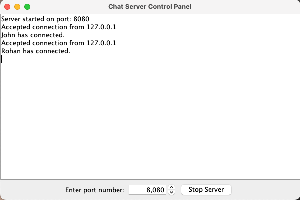
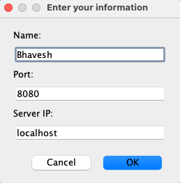
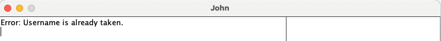
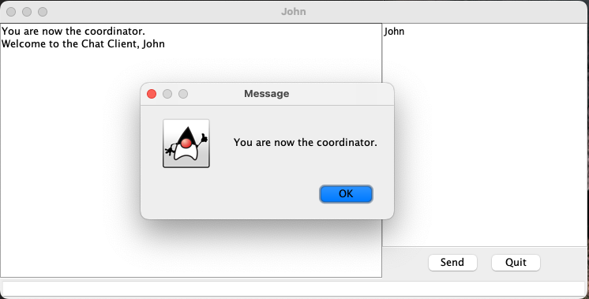
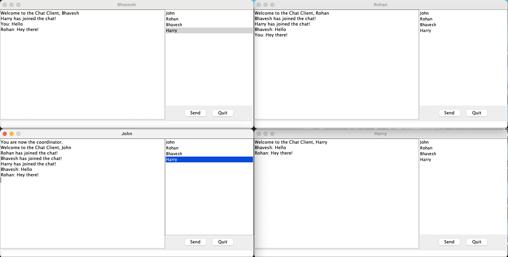
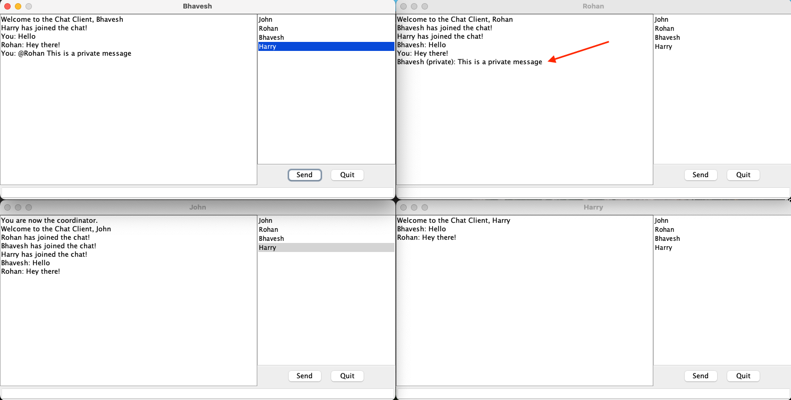
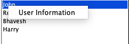
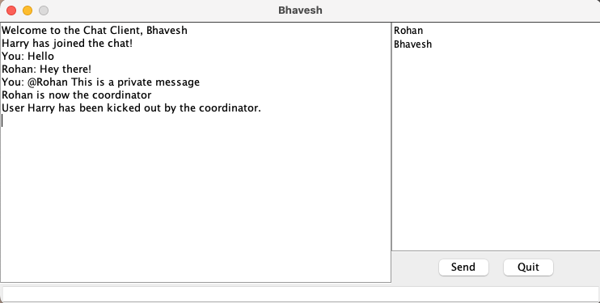
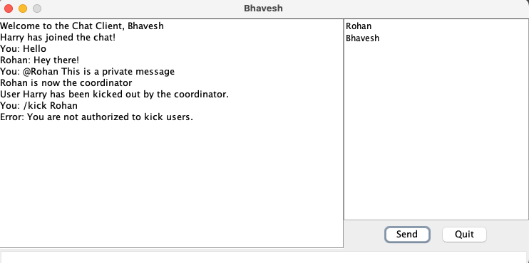

# Java Multi-Client Chat (Server + GUI Clients)

A Java-based multi-client chat application with a GUI server and GUI clients.  
The server accepts connections, manages active users, and relays messages.  
Clients can send broadcasts, private DMs, view active users, and if they’re admin they can kick users.  
The first client to join becomes the **coordinator** automatically.

---

## Features

- **GUI Server**: Start/stop server, view join events. Default port **8080** (valid range 0–65535).
- **GUI Client**: Connect with **unique** username, IP, and port; duplicate usernames are rejected with an error.
- **Coordinator election**: First client to join becomes coordinator; if they quit, the next user in the list becomes the new coordinator.
- **Messaging**:
    - Broadcast to all users
    - Private messages via `@receiver your message`
- **Admin actions**: `/kick "username"` to remove a user (non-admins get an error).
- **User info**: Right-click a username → “User Information”, or `/requestuserinfo Username`.
- **Graceful shutdown**: “Stop server” disconnects all clients.

---

## Getting Started

### Prerequisites
- Java 8+ (or the version your project targets)
- (Optional) An IDE like IntelliJ IDEA / Eclipse, or `javac` + `java`

### Run the Server
1. Open the project in your IDE or compile from CLI.
2. Launch `ServerGUI.java`.
3. Enter a port (default **8080**) and start the server.

### Run Clients
1. Launch `ClientMain.java` for each client you want to create.
2. Enter a **unique** username, the server IP, and the server port. Duplicate names are rejected.

### Using the Chat
- **Broadcast**: type a normal message and send.
- **Private DM**: `@receiver Hello!`
- **Kick (admin only)**: `/kick "username"`
    - Non-admins see an error if they try this.
- **User Info**: Right-click a user → “User Information” or `/requestuserinfo Username`.
- **Stop server**: Click **Stop Server** in `ServerGUI` (disconnects all clients).

---

## Screenshots

| Description | Image |
|-------------|-------|
| Server port prompt |  |
| Server running with client join |  |
| Client connect screen |  |
| Duplicate username error |  |
| Coordinator assigned after first join |  |
| Broadcast message to all |  |
| Private message with @receiver |  |
| User list and User Information |  |
| Admin kick success |  |
| Non-admin kick error |  |

---
## Limitations
- Port must be 0–65535 (default 8080).
- Usernames must be unique.

---

## Roadmap
- Persistent chat history
- Authentication and roles in UI
- Rich text / file sharing
- Automated coordinator election visuals

---

